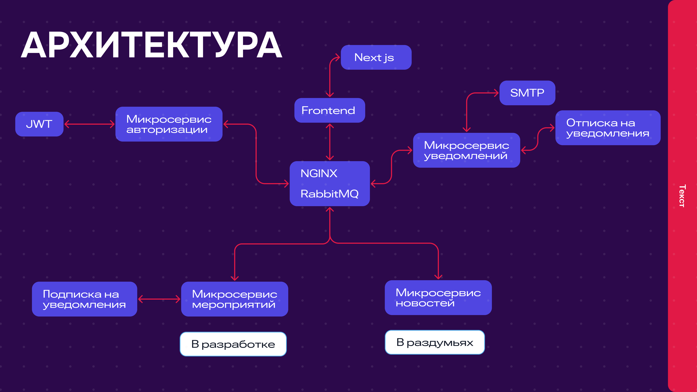

# Архитектура - https://mihest.ru/

# Краткое описание решения
- Пользователь заходит на сайт и видит перед со мной самое ближайшее мероприятие с отчетом до даты начала
- Следующий блок после отчета он видит краткое описание ближайших мероприятий с датами
- После этого он видит блок новостей которые будут ежедневно проверятся с канала новостей на хабре (В раздумьях)
- Так же он может открыть страницу календаря и посмотреть мероприятия на определённую дату с отметкой имеются ли там вообще мероприятия и если мероприятие заинтерисует, он может подключить уведомления, чтобы они пришли за 1, 2, 3 дня до начала
- После регистрации пользователю приходит письмо с ссылкой на подтверждения почты, если пользователь не подтвердит почту в течение 5 минут, то он сможет отправить письмо снова в личном кабинете
- Так же если пользователь забыл пароль он может восстановить его при помощи указанной почти и тем самым одновременно подтвердит почту, если она не была до этого подтверждена
- В личном профиле пользователь может редактировать свою информацию, если изменяется почта, то нужно её подтвердить заного

## Ссылки
- Макет - https://www.figma.com/design/KVSPw1ZBtBdS1JzWGhHyoG/Untitled?node-id=0-1&node-type=canvas&t=8V1b4E71cJhVUWtg-0
- Сайт - https://mihest.ru/
- Видео + презентация - https://disk.yandex.com.am/client/disk/презентация
На этом пока что всё наверное

